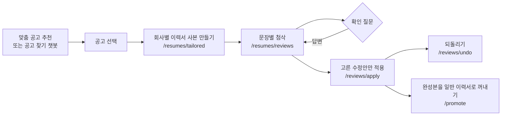

# 공고 맞춤 이력서 첨삭 (cover_letter_rag)

학생이 [채용공고 추천봇](../job_matching_bot/README.md)에서 고른 공고를 기준으로 **이력서 문장별 수정안**을
만들고, 학생이 고른 수정안만 이력서에 적용한다. 적용한 것은 되돌릴 수 있다.

핵심 원칙은 하나다. **이력서에 없는 경험·기술·수치를 만들지 않는다.** 모자란 정보는 지어 넣지 않고
학생에게 확인 질문으로 묻는다.

> 폴더 이름은 처음 만든 자기소개서 첨삭 RAG에서 왔다. 지금 앱이 쓰는 기능은 아래 "공고 맞춤 첨삭"이고,
> 초기 공고 검색·자기소개서 첨삭 API는 [레거시 API](#레거시-api-초기-rag-실험)로 남아 있다.

## 사용자 흐름



1. **공고 원문은 서버가 읽는다.** 앱은 `job_id`만 보낸다. 서버가 공고 원문 SQLite(`job_store.sqlite`)를 읽기 전용으로 열어 본문 전체를 가져온다. Pinecone에 있는 1,200자 요건 발췌로 대신하지 않는다.
2. **원본 이력서를 건드리지 않는다.** 공고마다 이력서 사본(`tailoredResumes`)을 만들고 거기서 첨삭·적용한다. 같은 이력서·공고·공고 버전이면 같은 사본을 돌려준다(버튼을 여러 번 눌러도 하나).
3. **이력서도 서버가 읽는다.** Firebase 토큰으로 본인·기수·활성 상태를 확인한 뒤 Firestore 저장본을 읽는다. 그래서 앱은 첨삭 전에 이력서를 먼저 저장한다.
4. 모델이 문장별 수정안을 만들면 **서버가 규칙으로 한 번 더 검증**하고, 통과하지 못한 수정안은 보류한다.
5. 학생이 체크한 수정안만 적용한다. 적용 전 내용은 백업해 두고, 그 뒤 수정이 없을 때만 되돌린다.

## 처리 순서 (첨삭 한 번)

| 단계 | 하는 일 |
|---|---|
| 인증·권한 | Firebase ID 토큰 → uid, `users/{uid}`의 `isActive`·`cohortId`, 이력서 `userId` 확인 |
| 공고 확인 | 저장소에서 공고 조회. 마감(`status≠OPEN`, 마감일 지남)이면 409, 본문이 비었거나 이미지뿐이면 422 |
| 버전 고정 | 이력서 내용 해시(`input_hash`)와 공고 스냅샷 해시를 요청에 싣는다. 읽은 뒤 바뀌면 409 |
| 입력 만들기 | 이름·전화·이메일·생년월일, URL, 내부 ID를 빼고 필드별 원문(`input_fields`)을 만든다. 자유 서술 속 이메일·전화번호는 `[연락처 삭제]`로 가린다 |
| 생성 | LangChain `ChatPromptTemplate` + OpenAI Responses API, JSON 스키마 구조화 출력. 자동 재시도 끔 |
| 사후 검증 | 아래 표 |
| 저장 | `aiReviews/{request_id}`에 `processing → complete / failed`. 같은 `request_id`로 다시 오면 저장된 결과를 준다 |

### 서버가 보류하는 수정안

모델 출력을 그대로 믿지 않는다. 다음에 걸리면 `validation_issues`를 달고 적용할 수 없게 한다.

- 원문에 없는 **새 수치·기술명·역할**이 들어감 (공고에만 있는 기술을 지원자 경험처럼 넣는 것 포함)
- 부정 → 긍정, 진행 중 → 완료, 참여 → 주도처럼 **사실 상태가 바뀜**
- 수치의 부호가 바뀜, 가려진 연락처가 들어간 문장을 교체함
- `original_quote`를 원문에서 찾을 수 없음, 이미 고른 수정 범위와 겹침
- 다른 프로젝트의 답변·수치를 가져옴 (같은 경험의 필드와 그 경험에 단 답변만 근거로 인정)
- 원문과 같거나 빈 수정안

"만들어 줘", "지어내 줘" 같은 답변은 사실로 쓰지 않는다.

### 응답에서 볼 것

| 필드 | 의미 |
|---|---|
| `sentence_reviews` | 원문, 이유, 수정안, 근거 인용, 상태(`unchanged`/`formatting`/`improved`/`needs_confirmation`), 수정 종류(`spelling`/`tone`/`clarity`/`content`) |
| `questions` | 최대 10개의 확인 질문과 `question_id` |
| `diagnostics` | 7개 기준(희망 표현, 감상 위주, 추상적 성과, 배치, 직무 관련성, 중복, 기업 맞춤)별 `issue`/`clear`/`not_evaluated`. 공고가 없으면 직무 관련성·기업 맞춤은 `not_evaluated` |
| `star_checks` | 경험별 상황·과제·행동·결과 중 빠진 것 |
| `changes` | 이전 첨삭 대비 해결·미해결·새로 생긴 기준 |
| `telemetry` | 모델, 프롬프트 버전, 지연, 토큰 수 |

전체 계약은 [docs/resume-review-v2.md](docs/resume-review-v2.md), 검증 규칙은
[docs/resume-review-quality.md](docs/resume-review-quality.md)에 있다.

## API

앱은 통합 서버(8000)의 `/resume-review` 아래로 부른다. 모두 `Authorization: Bearer <Firebase ID 토큰>`이 필요하다.

| 메서드 | 경로 (`/resume-review` 뒤) | 설명 |
|---|---|---|
| GET | `/api/v1/resumes/review-context` | 첨삭 전에 서버 저장본과 공고 스냅샷, 해시를 받는다. `Cache-Control: no-store` |
| POST | `/api/v1/resumes/tailored` | 공고별 이력서 사본 만들기 |
| GET | `/api/v1/resumes/{resume_id}/tailored` | 사본 목록과 첨삭 진행 상태 |
| GET | `/api/v1/resumes/{resume_id}/tailored/{id}` | 사본 하나 |
| PUT | `/api/v1/resumes/{resume_id}/tailored/{id}/session` | 첨삭 화면 진행 상태 저장(창을 닫았다 열어도 이어서) |
| POST | `/api/v1/resumes/{resume_id}/tailored/{id}/promote` | 완성한 사본을 일반 이력서 편집기에서 열 수 있게 꺼낸다 |
| DELETE | `/api/v1/resumes/{resume_id}/tailored/{id}` | 사본과 하위 첨삭·적용 기록 삭제 |
| POST | `/api/v1/resumes/reviews` | 첨삭. 답변을 실어 다시 보내면 재첨삭 |
| POST | `/api/v1/resumes/reviews/apply` | 고른 수정안 적용 ([명세](docs/resume-apply.md)) |
| POST | `/api/v1/resumes/reviews/undo` | 적용 되돌리기 |

```json
// POST /resume-review/api/v1/resumes/reviews
{
  "cohort_id": "cohort_34",
  "resume_id": "resume-id",
  "tailored_resume_id": "tailored_...",
  "selected_job_id": "<공고 ID>",
  "expected_job_hash": "review-context에서 받은 스냅샷 해시",
  "request_id": "review-001"
}
```

| 상태 | 언제 |
|---|---|
| 401 | 토큰 없음·만료 |
| 403 | 다른 기수, 비활성 계정 |
| 404 | 없는 이력서, 남의 이력서 |
| 409 | 이력서·공고 버전이 바뀜, 공고 마감, 같은 `request_id`에 다른 입력, 이미 승인된 이력서에 적용 |
| 422 | 입력 오류, 공고 본문 없음 |
| 503 | 공고 저장소·Firebase·OpenAI를 쓸 수 없음 |

## Firestore 저장 위치

```text
cohorts/{cohortId}/resumes/{resumeId}          원본 이력서. 공고 맞춤 첨삭은 이 문서를 바꾸지 않는다
  └─ tailoredResumes/{tailoredId}              공고별 사본, 첨삭 진행 상태(reviewSession)
       ├─ aiReviews/{requestId}                첨삭 결과
       └─ aiApplications/{requestId}           적용 전 백업, 적용 후 해시
cohorts/{cohortId}/resumes/matched_{...}       promote로 꺼낸 편집용 이력서
```

`tailored_resume_id` 없이 요청하면(공고 없는 일반 첨삭) `aiReviews`·`aiApplications`가 원본 이력서 아래에 생긴다.

Admin SDK는 Firestore 규칙을 우회한다. 그래서 **본인·기수·소유권 검사를 서버 코드에서 빼면 안 된다.**
`aiReviews`·`aiApplications`에는 클라이언트 직접 읽기 규칙을 두지 않는다(백업에 원문 개인정보가 있다).

## 실행

레포 루트 `.env`에서 설정을 읽는다.

```text
OPENAI_API_KEY=
OPENAI_MODEL=gpt-5.6-luna
OPENAI_REASONING_EFFORT=medium
FIREBASE_PROJECT_ID=skn34-3rd-2team
MATCHING_JOB_STORE_PATH=         # 비우면 job_matching_bot/artifacts/job_store.sqlite
CORS_ALLOW_ORIGIN_REGEX=http://(localhost|127\.0\.0\.1)(:\d+)?
```

서비스 계정 JSON은 레포 밖에 두고 `GOOGLE_APPLICATION_CREDENTIALS`에 경로를 지정한다.

**공고 원문 DB가 있어야 한다.** 레포에 올리지 않는 파일이라(375MB), 아래 스크립트가 Firebase Storage의
팀 공유본이 새로 올라왔을 때만 받아 검증·교체한 뒤 통합 서버를 켠다.

```powershell
.\scripts\start-backend.ps1
```

직접 켤 때:

```powershell
python -m uvicorn app.integrated:app --app-dir cover_letter_rag --host 127.0.0.1 --port 8000
```

| 주소 | 내용 |
|---|---|
| `http://127.0.0.1:8000/docs` | 추천봇 API 문서 |
| `http://127.0.0.1:8000/resume-review/docs` | 첨삭 API 문서 |

통합 서버(`app/integrated.py`)는 네 모듈을 한 프로세스로 묶는다. 추천봇과 이 모듈이 둘 다
`/api/v1/jobs/recommend`를 갖고 있고 스키마가 달라서, 이 모듈은 `/resume-review` 아래로 분리했다.

```text
/api/v1/student-chatbot/*   chatbot/        학생 챗봇
/api/v1/study-notes/*       study_notes/    공부방 노트
/resume-review/*            cover_letter_rag 첨삭 (이 모듈)
/*                          job_matching_bot 추천·공고 찾기 챗봇
```

## 테스트

```powershell
pip install -e ./cover_letter_rag[dev]
$env:PYTHONPATH = (Get-Location).Path     # 레포 루트. 공고 저장소 읽기가 job_matching_bot을 import한다
cd cover_letter_rag
pytest
```

`tests/`의 14개 파일(127개 테스트)은 가짜 Firebase·가짜 LLM·임시 SQLite로 돈다. API 키가 필요 없다.

| 파일 | 검증 |
|---|---|
| `test_review_workflow.py`, `test_resume_review.py` | 첨삭 흐름, 버전 충돌, 중복 요청, 재첨삭 |
| `test_resume_quality.py` | 수치·기술·역할·부정·상태 변경 보류, 겹치는 수정안 제거 |
| `test_resume_apply.py` | 수정안 적용·되돌리기 |
| `test_tailored_resumes.py` | 같은 공고로 여러 번 눌러도 사본 하나, 목록, 진행 상태 복원, 선택한 사본만 삭제 |
| `test_matching_handoff.py` | 공고 원문 전체 읽기, 쓸 수 없는 공고 거부, 이미지뿐인 공고, 통합 서버 경로 |
| `test_grounding.py`, `test_technology.py` | 인용 근거 검증, 기술명 별칭 |
| 나머지 | 레거시 검색·추천·인덱싱, Pinecone·Chroma 어댑터 |

실제 Firebase·OpenAI와의 통합 성공이나 첨삭 품질을 증명하는 테스트는 아니다. 품질 평가 기준은
[docs/resume-review-quality.md](docs/resume-review-quality.md)의 사람 대조 표를 따른다.

## 레거시 API (초기 RAG 실험)

처음에는 이 모듈이 공고 인덱스를 직접 만들고 검색했다. 지금 앱은 쓰지 않지만 코드와 테스트는 남아 있다.

| 경로 | 설명 |
|---|---|
| `POST /api/v1/jobs/search` | 이력서로 공고 Top-k 검색 |
| `POST /api/v1/profiles/analyze` | 이력서 직접 인용이 있는 기술·경험 추출 |
| `POST /api/v1/jobs/recommend` | 분석 → 검색 → 근거 포함 추천 |
| `POST /api/v1/jobs/compare` | 공고 요구사항과 이력서 근거 비교 |
| `POST /api/v1/reviews` | 이력서·공고·문항·초안으로 자기소개서 첨삭 |

인덱싱은 요청 중에 하지 않고 따로 실행한다.

```powershell
cd cover_letter_rag
python -m scripts.index_jobs                               # data/jobs 정적 샘플 → 청킹 → 임베딩 → 저장
```

크롤링 JSONL은 `scripts/`의 JSONL 인덱싱 스크립트로 넣는다. `--validate-only`를 붙이면 중복 제거·품질 분류·청킹까지만 하고 비용이 들지 않는다.

- 같은 `job_id`를 다시 넣으면 기존 벡터를 지운 뒤 넣어 오래된 청크가 섞이지 않는다.
- 기존 인덱스의 차원·metric이 다르면 멈춘다.
- `VECTOR_STORE_PROVIDER=chroma`로 바꾸면 비용 없이 로컬 Chroma(`chroma_db/`)로 시험할 수 있다.
- `data/jobs/`의 샘플 공고는 채용 사이트 API 응답 형식을 검증하려고 만든 가짜 데이터다.

## 파일

| 파일 | 역할 |
|---|---|
| `app/integrated.py` | 통합 서버 진입점 |
| `app/main.py` | 첨삭 FastAPI 앱, 예외 → 상태 코드 변환 |
| `app/review_workflow.py` | 첨삭 오케스트레이션, 버전 해시, 연락처 가림, 중복 요청 처리 |
| `app/resume_review.py` | 필드 추출, 생성기, 사후 근거 검증 |
| `app/resume_apply.py` | 적용·되돌리기 트랜잭션 |
| `app/tailored_resumes.py` | 공고별 이력서 사본 |
| `app/matching_handoff.py` | 공고 원문 SQLite 읽기 |
| `app/firebase_gateway.py` | Firebase 인증, 이력서·사본 읽기·쓰기 |
| `app/prompts.py`, `app/models.py` | 프롬프트, 요청·응답·구조화 출력 스키마 |
| `app/service.py`, `app/vector_store.py`, `app/crawled_jobs.py` | 레거시 검색·추천·첨삭, Pinecone/Chroma 어댑터, 크롤링 JSONL 정리 |
| `docs/` | 통합·첨삭 계약·적용 API·품질 기준 문서 |

## 알려진 한계

- 의미가 미묘하게 바뀌는 환각까지 모두 잡지는 못한다. 규칙은 보수적인 문자열 비교라 오탐·누락이 있다. 최종 판단은 학생이 원문과 수정안을 비교해서 한다.
- 추천봇 API 쪽에는 아직 Firebase 인증이 없다. 통합 서버를 그대로 공개 배포하면 안 된다.
- 서버가 처리 중에 꺼지면 `processing` 상태가 남는다. 자동으로 만료·재실행하지 않는다.
