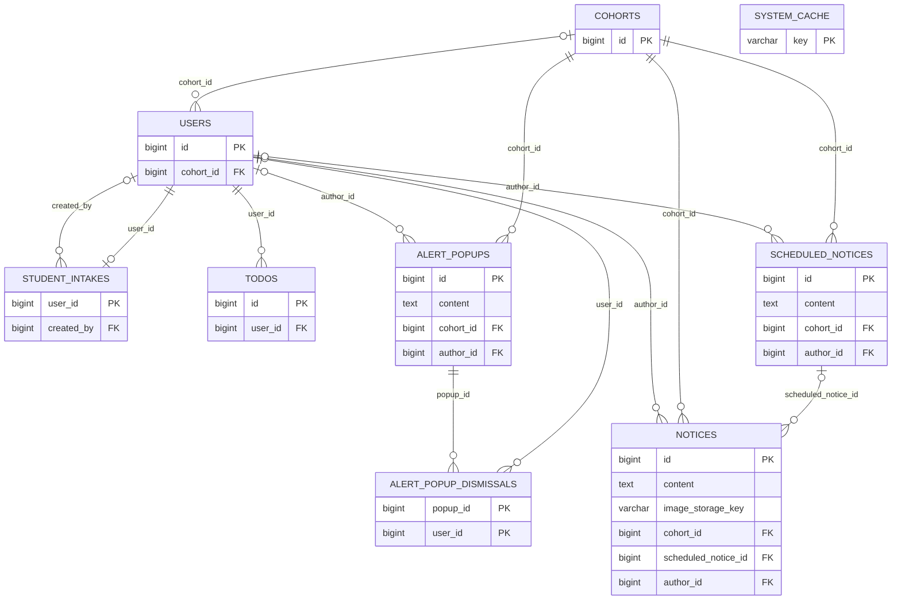
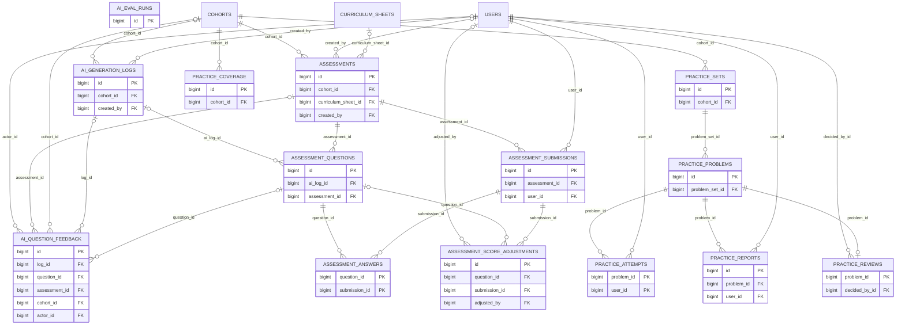
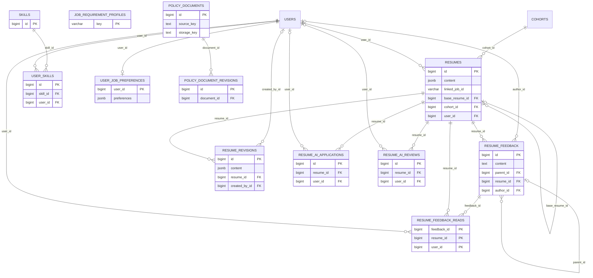
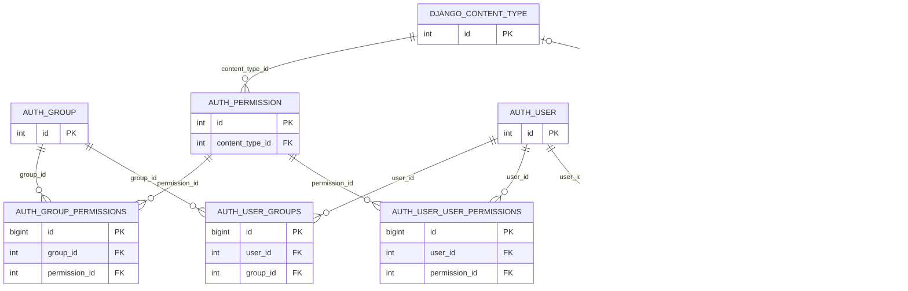
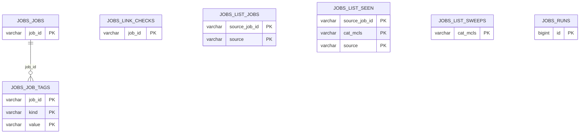

# Physical ERD — validation RDS snapshot

2026-09-23 `lms_migration_validation_20260923`의 PostgreSQL catalog를 읽어 작성한 물리 ERD다. `public` 73개 + `jobs` 7개 = **80개 base table**을 모두 포함한다. Mermaid는 가독성을 위해 7개 영역으로 나눴으며, 다른 영역의 부모 테이블은 관계선에서 반복 표시된다. `public` FK 122개 + `jobs` FK 1개 = **123개 FK**를 표시한다.

각 테이블 상자에는 PK, FK 및 선택된 핵심 컬럼만 표시한다. 전체 컬럼 751개의 명세는 DB catalog와 Django migration이 기준이다. 관계선은 실제 DB FK만 나타낸다. `resumes.linked_job_id`는 `jobs.jobs`의 stable ID를 가리키는 **논리 참조**이며 FK가 아니므로 관계선을 그리지 않았다. S3/Pinecone/Redis도 DB 테이블이 아니다.

## Core / notices (9)

Tables: `public.cohorts`, `public.users`, `public.student_intakes`, `public.todos`, `public.notices`, `public.scheduled_notices`, `public.alert_popups`, `public.alert_popup_dismissals`, `public.system_cache`.

## Learning / curriculum / attendance (15)

```mermaid
erDiagram
    CURRICULUM_PDFS {
        bigint cohort_id PK
        varchar storage_key
        bigint updated_by FK
    }
    CURRICULUM_ROWS {
        bigint id PK
        bigint sheet_id FK
    }
    CURRICULUM_SHEETS {
        bigint id PK
        varchar storage_key
        bigint cohort_id FK
        bigint uploaded_by FK
    }
    INFLEARN_PACKAGES {
        bigint id PK
        bigint cohort_id FK
    }
    MATERIALS {
        bigint id PK
        varchar storage_key
        bigint cohort_id FK
    }
    SCHEDULES {
        bigint id PK
        bigint cohort_id FK
    }
    SEAT_PRESENCES {
        bigint id PK
        bigint cohort_id FK
        bigint updated_by FK
        bigint user_id FK
    }
    COHORT_SEATING {
        bigint cohort_id PK
        jsonb layout
        bigint updated_by FK
    }
    ATTENDANCES {
        bigint id PK
        bigint cohort_id FK
        bigint finalized_by_id FK
        bigint user_id FK
    }
    ATTENDANCE_ISSUE_REPORTS {
        bigint id PK
        bigint cohort_id FK
        bigint reviewed_by_id FK
        bigint user_id FK
    }
    STUDY_NOTES {
        bigint id PK
        bigint user_id FK
        bigint source_id FK
    }
    STUDY_SOURCES {
        bigint id PK
        bigint cohort_id FK
    }
    YOUTUBE_RECOMMENDATIONS {
        bigint id PK
        bigint cohort_id FK
    }
    RECOMMENDATION_EVENTS {
        bigint id PK
        bigint cohort_id FK
        bigint user_id FK
        bigint recommendation_id FK
    }
    MISSION_PROGRESS {
        bigint cohort_id PK
        bigint user_id PK
    }
    COHORTS ||--o{ ATTENDANCE_ISSUE_REPORTS : cohort_id
    USERS o|--o{ ATTENDANCE_ISSUE_REPORTS : reviewed_by_id
    USERS ||--o{ ATTENDANCE_ISSUE_REPORTS : user_id
    COHORTS ||--o{ ATTENDANCES : cohort_id
    USERS o|--o{ ATTENDANCES : finalized_by_id
    USERS ||--o{ ATTENDANCES : user_id
    COHORTS ||--o| COHORT_SEATING : cohort_id
    USERS o|--o{ COHORT_SEATING : updated_by
    COHORTS ||--o| CURRICULUM_PDFS : cohort_id
    USERS o|--o{ CURRICULUM_PDFS : updated_by
    CURRICULUM_SHEETS ||--o{ CURRICULUM_ROWS : sheet_id
    COHORTS ||--o{ CURRICULUM_SHEETS : cohort_id
    USERS o|--o{ CURRICULUM_SHEETS : uploaded_by
    COHORTS ||--o{ INFLEARN_PACKAGES : cohort_id
    COHORTS ||--o{ MATERIALS : cohort_id
    COHORTS ||--o{ MISSION_PROGRESS : cohort_id
    USERS ||--o{ MISSION_PROGRESS : user_id
    COHORTS ||--o{ RECOMMENDATION_EVENTS : cohort_id
    YOUTUBE_RECOMMENDATIONS o|--o{ RECOMMENDATION_EVENTS : recommendation_id
    USERS o|--o{ RECOMMENDATION_EVENTS : user_id
    COHORTS ||--o{ SCHEDULES : cohort_id
    COHORTS ||--o{ SEAT_PRESENCES : cohort_id
    USERS o|--o{ SEAT_PRESENCES : updated_by
    USERS ||--o{ SEAT_PRESENCES : user_id
    STUDY_SOURCES o|--o{ STUDY_NOTES : source_id
    USERS ||--o{ STUDY_NOTES : user_id
    COHORTS ||--o{ STUDY_SOURCES : cohort_id
    COHORTS ||--o{ YOUTUBE_RECOMMENDATIONS : cohort_id
```

Tables: `public.curriculum_pdfs`, `public.curriculum_rows`, `public.curriculum_sheets`, `public.inflearn_packages`, `public.materials`, `public.schedules`, `public.seat_presences`, `public.cohort_seating`, `public.attendances`, `public.attendance_issue_reports`, `public.study_notes`, `public.study_sources`, `public.youtube_recommendations`, `public.recommendation_events`, `public.mission_progress`.

## Assessments / practice / AI logs (14)

Tables: `public.assessments`, `public.assessment_questions`, `public.assessment_answers`, `public.assessment_submissions`, `public.assessment_score_adjustments`, `public.ai_eval_runs`, `public.ai_generation_logs`, `public.ai_question_feedback`, `public.practice_sets`, `public.practice_problems`, `public.practice_attempts`, `public.practice_reports`, `public.practice_reviews`, `public.practice_coverage`.

## Submissions / mileage / teams (13)

```mermaid
erDiagram
    SUBMISSION_TASKS {
        bigint id PK
    }
    SUBMISSION_TASK_COHORTS {
        bigint id PK
        bigint cohort_id FK
        bigint task_id FK
    }
    SUBMISSION_RESPONSES {
        bigint id PK
        bigint user_id FK
        bigint task_id FK
    }
    RECORD_SUBMISSIONS {
        bigint id PK
        bigint cohort_id FK
        bigint reviewed_by FK
        bigint user_id FK
    }
    RECORD_SUBMISSION_FILES {
        bigint id PK
        varchar storage_key
        bigint submission_id FK
    }
    MILEAGE_CART_ITEMS {
        bigint product_id PK
        bigint user_id PK
    }
    MILEAGE_PRODUCTS {
        bigint id PK
        bigint cohort_id FK
    }
    MILEAGE_SETTINGS {
        bigint cohort_id PK
        bigint updated_by FK
    }
    MILEAGE_TRANSACTIONS {
        bigint id PK
        bigint cohort_id FK
        bigint adjusted_by FK
        bigint user_id FK
    }
    PURCHASE_REQUESTS {
        bigint id PK
        bigint cohort_id FK
        bigint processed_by FK
        bigint user_id FK
    }
    PURCHASE_REQUEST_ITEMS {
        bigint id PK
        bigint product_id FK
        bigint request_id FK
    }
    PROJECT_TEAMS {
        bigint id PK
        bigint cohort_id FK
        bigint updated_by FK
    }
    PROJECT_TEAM_MEMBERS {
        bigint team_id PK
        bigint user_id PK
    }
    MILEAGE_PRODUCTS ||--o{ MILEAGE_CART_ITEMS : product_id
    USERS ||--o{ MILEAGE_CART_ITEMS : user_id
    COHORTS ||--o{ MILEAGE_PRODUCTS : cohort_id
    COHORTS ||--o| MILEAGE_SETTINGS : cohort_id
    USERS o|--o{ MILEAGE_SETTINGS : updated_by
    USERS o|--o{ MILEAGE_TRANSACTIONS : adjusted_by
    COHORTS ||--o{ MILEAGE_TRANSACTIONS : cohort_id
    USERS ||--o{ MILEAGE_TRANSACTIONS : user_id
    PROJECT_TEAMS ||--o{ PROJECT_TEAM_MEMBERS : team_id
    USERS ||--o{ PROJECT_TEAM_MEMBERS : user_id
    COHORTS ||--o{ PROJECT_TEAMS : cohort_id
    USERS o|--o{ PROJECT_TEAMS : updated_by
    MILEAGE_PRODUCTS o|--o{ PURCHASE_REQUEST_ITEMS : product_id
    PURCHASE_REQUESTS ||--o{ PURCHASE_REQUEST_ITEMS : request_id
    COHORTS ||--o{ PURCHASE_REQUESTS : cohort_id
    USERS o|--o{ PURCHASE_REQUESTS : processed_by
    USERS ||--o{ PURCHASE_REQUESTS : user_id
    RECORD_SUBMISSIONS ||--o{ RECORD_SUBMISSION_FILES : submission_id
    COHORTS ||--o{ RECORD_SUBMISSIONS : cohort_id
    USERS o|--o{ RECORD_SUBMISSIONS : reviewed_by
    USERS ||--o{ RECORD_SUBMISSIONS : user_id
    SUBMISSION_TASKS ||--o{ SUBMISSION_RESPONSES : task_id
    USERS ||--o{ SUBMISSION_RESPONSES : user_id
    COHORTS ||--o{ SUBMISSION_TASK_COHORTS : cohort_id
    SUBMISSION_TASKS ||--o{ SUBMISSION_TASK_COHORTS : task_id
```

Tables: `public.submission_tasks`, `public.submission_task_cohorts`, `public.submission_responses`, `public.record_submissions`, `public.record_submission_files`, `public.mileage_cart_items`, `public.mileage_products`, `public.mileage_settings`, `public.mileage_transactions`, `public.purchase_requests`, `public.purchase_request_items`, `public.project_teams`, `public.project_team_members`.

## Career / resumes / policy (12)

Tables: `public.resumes`, `public.resume_feedback`, `public.resume_feedback_reads`, `public.resume_revisions`, `public.resume_ai_applications`, `public.resume_ai_reviews`, `public.skills`, `public.user_skills`, `public.user_job_preferences`, `public.job_requirement_profiles`, `public.policy_documents`, `public.policy_document_revisions`.

## Django framework tables (10)

Tables: `public.auth_group`, `public.auth_group_permissions`, `public.auth_permission`, `public.auth_user`, `public.auth_user_groups`, `public.auth_user_user_permissions`, `public.django_admin_log`, `public.django_content_type`, `public.django_migrations`, `public.django_session`.

## Jobs crawler schema (7)

Tables: `jobs.job_tags`, `jobs.jobs`, `jobs.link_checks`, `jobs.list_jobs`, `jobs.list_seen`, `jobs.list_sweeps`, `jobs.runs`.

## 범위 확인

- 고유 테이블: 80/80
- 실제 FK: 123/123
- Django framework 10개 테이블은 LMS `users`와 별도의 `auth_user` 체계다. 현재 LMS 로그인은 `public.users`를 사용한다.
- 이 문서는 검증 DB 시점의 스냅샷이다. 운영 DB 설계 완료 선언이나 전체 API 기능 검증을 의미하지 않는다.
