# PostgreSQL Logical ERD

실제 검증 DB의 80개 테이블·123개 FK를 모두 확인하려면 [Physical ERD](erd-physical.md)를 본다.
이 문서는 핵심 업무 관계만 추린 논리도다.

```mermaid
erDiagram
    COHORTS ||--o{ USERS : current_members
    COHORTS ||--|| COHORT_SEATING : has
    USERS ||--o{ SEAT_PRESENCES : checked
    COHORTS ||--o{ SEAT_PRESENCES : contains

    USERS ||--o{ ATTENDANCES : has
    COHORTS ||--o{ ATTENDANCES : history
    USERS ||--o{ ATTENDANCE_ISSUE_REPORTS : submits

    SUBMISSION_TASKS ||--o{ SUBMISSION_TASK_COHORTS : targets
    COHORTS ||--o{ SUBMISSION_TASK_COHORTS : receives
    SUBMISSION_TASKS ||--o{ SUBMISSION_RESPONSES : receives
    USERS ||--o{ SUBMISSION_RESPONSES : submits

    USERS ||--o{ RECORD_SUBMISSIONS : submits
    RECORD_SUBMISSIONS ||--o{ RECORD_SUBMISSION_FILES : contains

    COHORTS ||--o{ ASSESSMENTS : has
    ASSESSMENTS ||--o{ ASSESSMENT_QUESTIONS : contains
    ASSESSMENTS ||--o{ ASSESSMENT_SUBMISSIONS : receives
    USERS ||--o{ ASSESSMENT_SUBMISSIONS : submits
    ASSESSMENT_SUBMISSIONS ||--o{ ASSESSMENT_ANSWERS : contains
    ASSESSMENT_QUESTIONS ||--o{ ASSESSMENT_ANSWERS : answered
    ASSESSMENT_SUBMISSIONS ||--o{ ASSESSMENT_SCORE_ADJUSTMENTS : adjusted

    COHORTS ||--o{ PRACTICE_SETS : has
    PRACTICE_SETS ||--o{ PRACTICE_PROBLEMS : contains
    USERS ||--o{ PRACTICE_ATTEMPTS : solves
    PRACTICE_PROBLEMS ||--o{ PRACTICE_ATTEMPTS : receives
    USERS ||--o{ PRACTICE_REPORTS : reports
    PRACTICE_PROBLEMS ||--o{ PRACTICE_REPORTS : receives
    PRACTICE_PROBLEMS ||--o| PRACTICE_REVIEWS : reviewed
    USERS ||--o{ PRACTICE_REVIEWS : decides
    COHORTS ||--o{ PRACTICE_COVERAGE : tracks

    USERS ||--o{ MILEAGE_TRANSACTIONS : owns
    COHORTS ||--|| MILEAGE_SETTINGS : configures
    COHORTS ||--o{ MILEAGE_PRODUCTS : offers
    USERS ||--o{ PURCHASE_REQUESTS : requests
    PURCHASE_REQUESTS ||--o{ PURCHASE_REQUEST_ITEMS : contains
    PURCHASE_REQUESTS ||--o{ MILEAGE_TRANSACTIONS : causes

    USERS ||--o{ RESUMES : owns
    RESUMES o|--o{ RESUMES : derives_tailored
    RESUMES ||--o{ RESUME_FEEDBACK : receives
    RESUMES ||--o{ RESUME_REVISIONS : versions

    USERS ||--o{ USER_SKILLS : has
    SKILLS ||--o{ USER_SKILLS : describes
    USERS ||--|| USER_JOB_PREFERENCES : configures

    PROJECT_TEAMS ||--o{ PROJECT_TEAM_MEMBERS : contains
    USERS ||--o{ PROJECT_TEAM_MEMBERS : joins
```



`resumes.linked_job_id`는 채용공고의 stable ID를 저장하지만 현재 PostgreSQL FK가
아니다. 물리 ERD에서 `jobs.jobs`와 `resumes` 사이에 FK 선을 그리지 않는다.

## Career projection
```text
PostgreSQL
User ─ UserSkill ─ Skill
  │
  ├─ Resume(content)
  └─ Project / Experience
                    │
Job ─ RequiredSkill ┘

        ↓ projector

Neo4j
(Student)-[:HAS_EXPERIENCE]->(Project)-[:USES]->(Skill)
(Skill)<-[:REQUIRES]-(Job)-[:POSTED_BY]->(Company)
```

Neo4j의 모든 핵심 node에는 PostgreSQL source ID를 보존한다.
