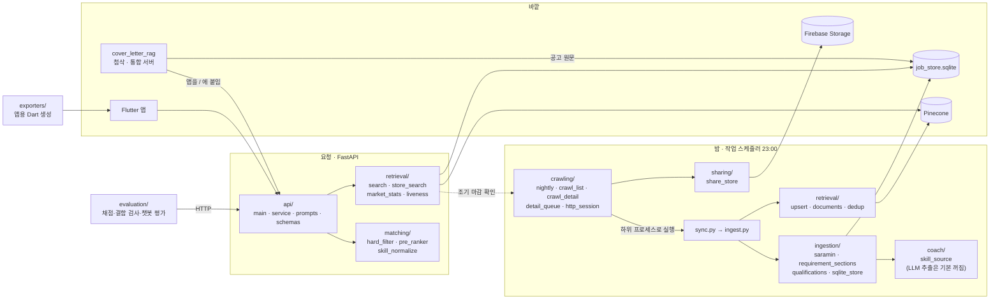

# 모듈 구조

`job_matching_bot/` 안의 폴더와 파일이 각각 무엇을 하고, 누가 누구를 부르는지 적는다. "쓰는 곳"은
코드의 `import`를 실제로 따라가 센 것이다(테스트 제외). 전체 흐름은 [architecture.md](architecture.md),
챗봇은 [chatbot.md](chatbot.md)에 있다.

## 1. 한눈에



층으로 보면 아래가 위를 모른다.

```text
schemas/ · config.py · env.py             데이터 모양과 경로·키. 누구든 쓴다
ingestion/ · coach/                        원본 → Job, 저장소
retrieval/ · matching/                     인덱스·조회·규칙 매칭
api/                                       서비스와 엔드포인트
crawling/ · sync.py · ingest.py            밤 배치(위를 조립한다)
evaluation/ · exporters/ · sharing/         도구
```

규칙에서 벗어난 연결이 셋 있다. 알고 고치지 않은 것이다.

| 연결 | 왜 |
|---|---|
| `retrieval/liveness.py` → `crawling/nightly.check_alive`, `crawling/http_session` | 낮의 조기 마감 확인이 밤 배치의 "페이지 열어 보기"를 그대로 쓴다. 판정 규칙이 둘이면 서로 어긋난다 |
| `ingestion/sqlite_store.py` → `retrieval/documents.py` | 저장할 때 인덱스 지문(`embed_hash`)을 같이 계산해 둔다 |
| `api/service.py` → `ingest.DEFAULT_STORE` | 저장소 경로 상수를 `ingest.py`에서 가져온다 |

## 2. 실행하는 것

| 명령 | 하는 일 | 누가 |
|---|---|---|
| `python -m job_matching_bot.crawling.nightly` | 목록 → 신규 상세 → 링크 확인 → 적재 → 공유 | 작업 스케줄러(매일 23:00) |
| `python -m job_matching_bot.sync` | 수집 원본 → 저장소 → Pinecone 증분 적재 | nightly가 하위 프로세스로 |
| `python -m uvicorn app.integrated:app --app-dir cover_letter_rag --port 8000` | 첨삭 + 추천·챗봇을 한 프로세스로 | 개발자 |
| `python -m job_matching_bot.ingest` | 원본 보존 → 정규화 → 저장소(인덱스 없이) | 수동 |
| `evaluation.recommend_eval` · `recommend_check` · `chat_eval` | 사람 채점 · 규칙 결함 검사 · 챗봇 평가 | 수동([test_report.md](test_report.md)) |
| `retrieval.index_state` | 저장소가 기억하는 인덱스 상태 보기·맞추기 | 수동 |
| `retrieval.refresh_metadata` | 벡터는 두고 메타데이터만 갱신(임베딩 비용 없음) | 수동 |
| `sharing.share_store` | 슬림 저장소 내려받기·올리기 | 팀원 · nightly |
| `exporters.resume_mocks_dart` · `skill_names_dart` | 앱이 읽는 Dart 파일 생성 | 수동 |
| `crawling.crawl_list` · `crawl_detail` · `detail_queue` | 각 단계만 따로 | 수동(디버깅) |
| `evaluation.scan_terms` | 헷갈리는 접두사 태그 후보 뽑기(Java⊂JavaScript) | 수동 |
| `evaluation.extract_compare` | LLM 요구역량 추출 vs 요건 구간 사전 매칭 표본 비교 | 수동 |

## 3. 폴더별

줄 수는 2026-09-14 기준이다.

### crawling/ — 수집

| 파일 | 줄 | 하는 일 | 핵심 | 쓰는 곳 |
|---|---:|---|---|---|
| `nightly.py` | 486 | 밤 배치 전체. 요일별 대분류, 목록 끝까지 훑기, 신규 상세, 사라진 공고 링크 확인, `sync` 실행, 공유 파일, 결과 요약 | `sweep`, `link_check`, `run_sync`, `run_stamp`, `prune` | 스케줄러, `retrieval/liveness` |
| `crawl_list.py` | 383 | 목록 한 쪽을 받아 공고 줄로 | `fetch_page`, `parse_item` | `nightly` |
| `crawl_detail.py` | 532 | 상세 페이지 → 조건·본문·태그. 마감 페이지 판정, HTML 주석으로 쪼개진 글자 복원 | `fetch_detail`, `parse_detail`, `crawl_details` | `nightly` |
| `detail_queue.py` | 202 | 상세 받을 순서. 이미 받은 것 빼고 인기 배지 → 순위 → 마감, 오래 기다린 공고 끼워 넣기 | `build_queue`, `priority` | `nightly` |
| `http_session.py` | 115 | 브라우저 같은 요청 헤더, 2.5~3.5초 간격, 차단 신호 감지 | `new_session`, `BlockedByTargetSiteError` | 수집 전부, `liveness` |
| `schedule_nightly.ps1` | — | 작업 스케줄러 등록·상태·지금 실행 | `-Register`, `-Status`, `-RunNow` | 개발자 |

### ingestion/ — 원본을 Job으로, 저장소

| 파일 | 줄 | 하는 일 | 쓰는 곳 |
|---|---:|---|---|
| `saramin.py` | 344 | 상세 원본 → `Job`. 경력·학력·고용형태·마감 해석, 기술 태그 분리, **메타가 경력무관인데 요건이 경력을 요구하면 경력직으로** | `ingest` |
| `requirement_sections.py` | 141 | 본문을 제목으로 잘라 자격요건·우대사항·주요업무 구간 | `saramin`, `coach`, `pre_ranker`, `documents`, 평가 |
| `qualifications.py` | 245 | 요건 구간에서 전공·자격증·병역·최소 연차 | `saramin`, `pre_ranker` |
| `saramin_tech_vocab.py` | 163 | 직무 코드표로 태그를 기술/키워드로 가르기, **글에서 기술 찾기** | `saramin`, `pre_ranker`, `store_search` |
| `skill_extractor.py` | 121 | 손으로 만든 기술 사전 매칭(구간 규칙 추출이 쓴다) | `coach/skill_source`, 평가 |
| `listing_conditions.py` | 171 | 목록 한 줄의 조건 글 → 지역·경력·고용형태·학력·마감 | `sqlite_store` |
| `detail_quality.py` | 34 | 본문이 이미지뿐인지, 요건 문장이 있는지 | `crawl_detail`, `saramin`, `sqlite_store`, 첨삭 모듈 |
| `excluded_roles.py` | 49 | 추천에서 뺄 직종(배달·운전 등) | `detail_queue` |
| `sqlite_store.py` | 803 | **저장소.** `jobs`·`job_tags`·`runs`·`list_seen`·`list_jobs`·`list_sweeps`·`link_checks` 표, 상태 전이, 컬럼 이관 | `job_store`, `service`, `liveness`, 평가 |
| `job_store.py` | 169 | 저장소 판정 규칙(content_hash upsert, 상태 전이)과 SQLite 저장소 열기(`open_store`, `.sqlite`/`.db`만) | 적재·인덱스 쪽 전부 |
| `record_files.py` | 71 | JSON Lines 원본 읽기·덧붙이기 | 수집·적재 |
| `raw_store.py` | 105 | 정규화 전 원본을 공고별로 보존, 다시 파싱 | `ingest` |
| `mock_source.py` | 105 | 통제된 가짜 공고 | 테스트 12개 파일 |

### coach/ — LLM 요구역량 추출

| 파일 | 줄 | 하는 일 |
|---|---:|---|
| `skill_source.py` | 136 | 요구역량을 어디서 뽑을지 고른다. **LLM → 실패하면 요건 구간 사전 매칭 → 구간이 없으면 전부 "모름".** 어느 경로인지 `method`에 남긴다 |
| `requirement_extractor.py` | 331 | LLM 추출. 필수/우대 구분, 근거 문장 대조로 원문에 없는 기술 버리기, 공고 본문의 지시 무시 |
| `openai_client.py` | 173 | 구조화 출력 호출 어댑터 |

**야간 배치에서는 LLM 추출이 꺼져 있다.** `sync.py`의 기본값이 `--no-llm`이라 요건 구간 사전 매칭만 쓴다.
비용이 없고 결과가 매번 같다. `--llm`으로 켤 수 있다.

켰을 때를 OPEN 공고 표본 200건으로 쟀다(`evaluation.extract_compare`).

| | 사전 매칭 | LLM |
|---|---:|---:|
| 글 본문 공고(153건) 중 기술 1개 이상 | 35 (23%) | 138 (90%) |
| 공고당 필수+우대 수 | 0.54 | 7.09 |
| 건당 시간(중앙값 / 90%) | — | 7.3초 / 15.1초 |
| 건당 토큰(입력 / 출력) | — | 1,454 / 768 |

- LLM이 뽑은 1,418개 중 기술(언어·프레임워크·DB·인프라·도구)은 449개다. 나머지는 도메인 775, 태도 194다.
- 기술 449개 중 72%는 사전에 없는 이름이다. "Adobe Photoshop", "AI 도구 활용"처럼 표기가 제각각이다. 그래서 이력서 기술과 겹침을 세는 `pre_ranker`는 그대로는 이 이름들을 쓰지 못한다.
- 사전 매칭이 필수로 본 기술을 LLM도 필수로 본 비율은 53%다.
- 원문에 근거가 없어 버린 기술은 15개다. 스키마 재시도와 실패는 0건이다.
- 하룻밤 신규 3,814건에 쓰면 입력 약 554만, 출력 약 293만 토큰이 든다. 동시 6건으로 약 80분이 더 걸린다.

**그래서 꺼 두기로 했다.** 많이 뽑지만 절반 이상이 도메인·태도이고, 기술 이름은 사전과 맞지 않아 순위에 바로 못 쓴다. 기술 겹침 순위를 바꿔도 추천 품질이 달라지지 않았다(A/B 채점). LLM은 이력서 구조화·재정렬·챗봇에 쓴다.

### retrieval/ — 인덱스와 조회

| 파일 | 줄 | 하는 일 | 쓰는 곳 |
|---|---:|---|---|
| `documents.py` | 134 | 공고 → 임베딩 글(요건 구간)·메타데이터·지문(`embed_hash`), 인덱스에 올릴지 | `upsert`, `sqlite_store`, 평가 |
| `dedup.py` | 95 | 인덱스에 올릴 공고 고르기: 마감 지남, 재등록 중복 | `upsert`, `refresh_metadata` |
| `upsert.py` | 256 | 지문이 바뀐 것만 임베딩해 올리고 내려간 것 지우기 | `sync` |
| `pinecone_index.py` | 110 | 인덱스 만들기·접속(키·이름·네임스페이스) | 인덱스 쓰는 곳 전부 |
| `search.py` | 126 | **추천의 벡터 검색.** 상태·지역·고용형태·연차 필터를 함께 건다 | `service` |
| `store_search.py` | 463 | **챗봇의 조건 조회.** 관련도, 표기 접기, 키워드는 직무와 함께, 연차, 빼고 찾기, 마감 시각 | `service`, `market_stats` |
| `market_stats.py` | 254 | 조건에 맞는 공고의 기술·지역·경력 분포(챗봇 질문) | `service` |
| `liveness.py` | 163 | 보내기 직전 공고 페이지 열어 조기 마감 확인(1시간 캐시, 차단이면 쉼) | `service` |
| `index_state.py` | 140 | 저장소의 인덱스 기록 보기·맞추기(도구) | — |
| `refresh_metadata.py` | 64 | 메타데이터만 갱신(도구) | — |

### matching/ — 규칙 매칭

| 파일 | 줄 | 하는 일 | 쓰는 곳 |
|---|---:|---|---|
| `hard_filter.py` | 178 | 경력·학력·지역(전국 근무)·고용형태·전공·자격증 → PASS / CHECK_REQUIRED / FAIL | `service`, `store_search`(연차 경계) |
| `pre_ranker.py` | 167 | 벡터 순위 50% + 기술 겹침 50%, 우대 자격증·전공 가산 → LLM에 보낼 12건 | `service` |
| `skill_normalize.py` | 58 | 기술명 표준키(ReactJS = React) | `pre_ranker`, `store_search`, `saramin_tech_vocab` |

### api/ — 서버

| 파일 | 줄 | 하는 일 |
|---|---:|---|
| `main.py` | 244 | FastAPI 앱. `/health`, `/api/v1/resume/profile`, `/api/v1/jobs/recommend`, `/recommend/stream`(SSE), `/api/v1/jobs/chat`. 서버 뜰 때 임베딩·인덱스 미리 데우기, 요청 시간 로그 |
| `service.py` | 1,437 | `RecommendService`(추천 7단계, 단계별 시간) · `ChatService`(막기·갈래·번호·더 보기·비교·마감 확인·답 조립) |
| `prompts.py` | 490 | 이력서 구조화 · 재정렬 · 챗봇 라우터 · 질문 · 공고 묻기 프롬프트 |
| `prompts_compare.py` | 89 | 공고 둘 비교 프롬프트 |
| `schemas.py` | 392 | 요청·응답과 LLM 구조화 출력 모델 |
| `abuse.py` | 93 | 모델을 부르기 전에 막는 욕설 목록 |
| `ops_meta.py` | 25 | 프롬프트 버전·모델·추론 강도(앱이 AI 로그에 옮긴다) |

### evaluation/ — 평가 도구

| 파일 | 줄 | 하는 일 |
|---|---:|---|
| `recommend_eval.py` | 483 | 추천을 받아 사람 채점 페이지·표를 만들고 점수 내기 |
| `grader_page.py` | 250 | 추천 채점 페이지(키 1/2/3) |
| `recommend_check.py` | 445 | 사람 없이 잡는 결함 8가지, 회차 기록(`fixtures/checks/`) |
| `app_resume.py` | 339 | 앱이 서버로 보내는 이력서 글을 파이썬으로 똑같이 만들기 |
| `chat_eval.py` | 583 | 챗봇 평가 네 층(라우터·서버·채점 페이지·점수), 답 규율 8가지 |
| `chat_grader_page.py` | 308 | 챗봇 답 문장 채점 페이지 |
| `scan_terms.py` | 121 | 헷갈리는 접두사 태그 후보 |

### 나머지

| 위치 | 하는 일 |
|---|---|
| `sync.py` (203줄) | 적재 파이프라인: 유효성 → 중복 → 정규화(`ingest`) → 품질·지문 → Pinecone → `runs` 표 기록 |
| `ingest.py` (208줄) | 원본 보존 → 정규화 → 저장소 upsert → 리포트. 저장소 경로 상수(`DEFAULT_STORE`)도 여기 있다 |
| `config.py` (45줄) | 경로(`artifacts/`, `fixtures/`, 앱 Dart 출력)와 지금 시각(`now()`, 테스트는 `tests/__init__.py`가 고정) |
| `env.py` (75줄) | 레포 루트 `.env` 읽기 |
| `schemas/` | `Job`(공통 공고) · `JobRecord`·`CollectionReport`(저장소 레코드·수집 리포트) · `ResumeProfile` |
| `sharing/share_store.py` (231줄) | 저장소에서 필요한 칸만 뽑아 압축해 Firebase Storage로 올리고 받기 |
| `exporters/` | `resume_mocks_dart.py`(가상 이력서 → 앱), `skill_names_dart.py`(공고에 쓰인 기술 이름 → 앱 태그 후보) |
| `tests/` | 단위 테스트 36개 파일, 646건. 외부 접속 없이 돈다 |
| `fixtures/` | 기술 코드표, 평가 케이스, 채점 라벨(`labels/`), 결함 검사 기록(`checks/`) |
| `artifacts/` | git 제외. 저장소 sqlite, 원본(`raw/`), 야간 요약·로그(`nightly/`), 평가 결과 |

## 4. 바깥과 닿는 곳

| 상대 | 누가 | 무엇을 |
|---|---|---|
| 채용 사이트 | `crawling/*`, `retrieval/liveness` | 목록·상세 페이지, 조기 마감 확인 |
| OpenAI | `api/service`(추천·챗봇), `retrieval/upsert`·`search`(임베딩), `coach`(꺼져 있음) | 채팅 모델, `text-embedding-3-small` |
| Pinecone | `retrieval/pinecone_index`를 거쳐 `upsert`·`search`·`liveness`(마감 표시) | `job-posting` 인덱스 |
| Firebase Storage | `sharing/share_store` | 슬림 저장소 |
| 첨삭 모듈 `cover_letter_rag` | `app/integrated.py`가 `api.main` 앱을 붙이고, `app/matching_handoff.py`가 저장소에서 고른 공고를 읽는다 | 포트 8000 하나, 공고 원문 |
| Flutter 앱 | `lib/features/resume/ai_coach/data/job_recommend_api_client.dart` | 추천·스트림·챗봇 호출 |

## 5. 정리할 거리

지금 동작에는 영향이 없지만 읽는 사람을 헷갈리게 하는 것들이다.

| 무엇 | 상태 |
|---|---|
| 파일 이름 `saramin*` | 한 사이트 전용 코드가 이름에 드러난다. 소스를 늘릴 때 나눈다 |

정리한 것:

- 쓰는 곳이 없던 `text_match.py`를 지웠다.
- 수집기 없이 파서만 있던 다른 사이트 정규화(`ingestion/jobkorea.py`)와 그 표본을 지웠다.
- 테스트만 쓰던 JSON 파일 저장소를 지웠다. `open_store`는 SQLite 경로만 받는다.
- 이관이 끝난 `migrate_store.py`를 지웠다.
- `coach/` LLM 추출을 야간 배치에서 켤지 표본 200건으로 재고, 꺼 두기로 했다(3장 coach/).
- 고정 기준 시각 `config.AS_OF`를 `config.now()`로 바꿨다. 이 시각이 운영 함수 7곳의 기본값이었다. 테스트는 같은 시각으로 시계를 고정한다.
