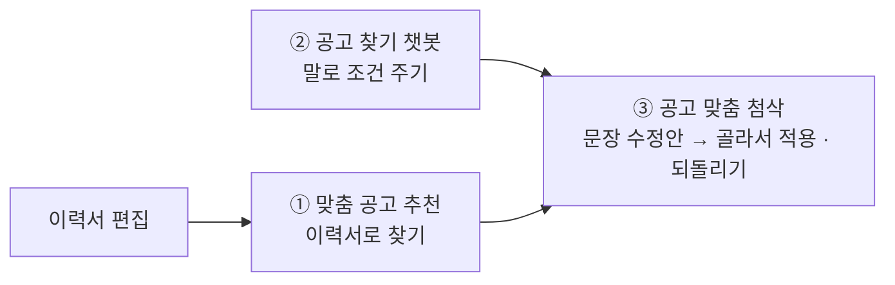

# Flutter LMS 앱

PLAYDATA 부트캠프 학생·강사·관리자가 쓰는 LMS 앱이다. Web(Chrome), Android, Windows에서 돈다.
데이터는 Firebase(Auth·Firestore·Storage·Functions)에 있고, AI 기능은 Python 통합 서버(포트 8000)를 부른다.

설치·계정 시드·Firebase 설정은 [SETUP.md](../SETUP.md)에 있다.

## 기술 스택

| 영역 | 사용 |
|---|---|
| 상태 관리 | `flutter_riverpod` |
| 라우팅 | `go_router` — 역할별 셸(학생 `/`, 강사 `/instructor`, 관리자 `/admin`) |
| 백엔드 | `firebase_auth`, `cloud_firestore`, `firebase_storage`, `cloud_functions` |
| AI 서버 호출 | `http` (추천·첨삭·챗봇 스트리밍) |
| 기타 | `pdf`·`printing`(이력서 PDF), `table_calendar`(출석 달력), `flutter_markdown_plus`(챗봇·노트 표시), `file_picker`, `shared_preferences` |

## 폴더 구조

```text
lib/
├── main.dart, bootstrap.dart, app.dart   # 진입점, Firebase 초기화, MaterialApp.router
├── firebase_options.dart
├── core/
│   ├── routing/      # app_router.dart(역할별 리다이렉트), route_paths.dart(경로 상수)
│   ├── theme/        # 테마·색·밀도 설정
│   ├── constants/    # 역할, 공휴일 표(scripts/fetch_holidays.py가 생성) 등
│   ├── widgets/, utils/, errors/
├── shared/
│   ├── models/       # Firestore 문서 모델 (user, cohort, resume, notice …)
│   ├── providers/    # 공용 Riverpod provider
│   ├── services/     # Storage, 프로필 사진, 자격시험 일정, AI 로그(aiOps)
│   ├── demo/         # 데모 모드용 메모리 저장소와 예시 계정
│   └── widgets/, data/, utils/, constants/
└── features/         # 기능별 화면 (아래 표)
```

기능 폴더 안은 대체로 `data/`(Firestore·API 접근) → `providers/` → `presentation/`(화면·위젯)로 나눈다.

## 기능

### 학생

| 기능 | 폴더 | 내용 |
|---|---|---|
| 대시보드 | `dashboard/` | 프로필, 출석 달력, 미션 진행, 내 좌석, 국가자격 시험 일정, 이번 주 커리큘럼 기반 학습 추천 |
| 이력서 | `resume/` | 이력서 작성·관리, 섹션별 강사 피드백 스레드, PDF 내보내기 |
| AI 취업 코치 | `resume/ai_coach/` | ① 맞춤 공고 추천 ② 공고 찾기 챗봇 ③ 공고 맞춤 첨삭 (아래 설명) |
| 학생 챗봇 | `chatbot/` | 정책·공지·전 기수 프로젝트·본인 LMS 데이터 질의응답 ([chatbot/](../chatbot/README.md)) |
| 공부방 | `study_room/` | 배정된 인프런 강의 패키지, 커리큘럼 추천 YouTube, AI 수업 노트 ([study_notes/](../study_notes/README.md)) |
| 기록실 | `records/` | 자격증·스터디·블로그·학습인증·프리코스 퀴즈 제출. 승인되면 마일리지 적립 |
| 게시판 | `hub/` | 공지 + 소통 피드 |
| 성취도평가 | `assessments/` | 응시, 결과·해설 |
| 마일리지 | `mileage/` | 잔액·내역, 상점, 장바구니, 구매 요청 |
| 설문·제출 | `forms/` | 구글폼 설문 과제 |
| 좌석 | `seating/` | 확정된 좌석 배치표 |
| 마이페이지·화면 설정 | `my_page/`, `settings/` | 개인 정보, 테마·색·밀도 |
| 이용 안내 투어 | `onboarding/` | 역할별 첫 로그인 투어, 마이페이지에서 다시 보기 |

### 강사

| 기능 | 폴더 | 내용 |
|---|---|---|
| 커리큘럼 | `instructor/`, `curriculum/` | 구글시트에서 받은 CSV 업로드·조회 |
| 성취도평가 | `instructor/` | 평가 만들기(커리큘럼 AI 초안 + 수동 문항), 제출물 채점 |
| 자리 확인·게시판 | `instructor/` | 강사 홈. 학생 착석 확인·보류, 공지 작성 |
| 이력서 피드백 | `resume/` | 학생 이력서 섹션별 피드백 |

### 관리자

| 기능 | 폴더 | 내용 |
|---|---|---|
| 학생·강사·기수 | `admin/` | 계정 생성(Functions), 상담 정보, 퇴소·복학, 기수 관리 |
| 출석·자리 확인 | `admin/`, `instructor/` | 기수별 당일 출석 조회·수정, 강사와 같은 자리 확인 화면 |
| 공지 | `admin/` | 공지, 예약 공지, 알림 팝업 |
| 기록실 승인 | `records/` | 제출물 승인·반려 |
| 마일리지 | `admin/` | 상품, 기수 설정(한도·적립 규칙), 구매 요청 승인, 수동 지급·차감 |
| 좌석 | `seating/` | 강의실 틀 만들기, 학생 배치, 프로젝트 팀 무작위 편성 |
| 공부방 | `admin/` | 인프런 패키지, 수업 저장소(AI 노트 원본), YouTube 추천 |
| 설문 | `admin/` | 구글폼 설문 등록, Apps Script 코드 복사 |
| AI 품질 | `admin/admin_ai_quality_screen.dart` | LLM 기능별 생성 로그·지연·사용자 피드백·프롬프트 버전 |

## AI 취업 코치 (`resume/ai_coach/`)

이력서 편집 화면 옆 패널에서 세 가지를 쓴다.



| 기능 | 호출 | 서버 모듈 |
|---|---|---|
| 맞춤 공고 추천 | `POST /api/v1/jobs/recommend/stream` (실패하면 일반 `/recommend`) | [job_matching_bot](../job_matching_bot/README.md) |
| 공고 찾기 챗봇 | `POST /api/v1/jobs/chat` | [job_matching_bot](../job_matching_bot/docs/chatbot.md) |
| 공고 맞춤 첨삭 | `/resume-review/api/v1/resumes/...` | [cover_letter_rag](../cover_letter_rag/README.md) |

- **첨삭은 저장본 기준이다.** 서버가 Firestore의 저장된 이력서를 읽으므로, 첨삭을 시작하면 패널이 먼저 저장한다.
- 첨삭 한 번이 40~70초 걸린다. 대화 상자로 띄우면 그동안 앱이 막히므로 **첨삭 창을 앱 맨 위 층(`review_dock.dart`)에 올리고**, 기다리는 동안 오른쪽 아래 막대로 내려 둘 수 있다. 다른 화면으로 옮겨도 요청이 끊기지 않는다.
- 결과를 쓰고 버리는 행동(공고 열기, 수정안 적용·되돌리기 등)은 Functions `recordAiOutcomeFeedback`으로 남긴다. 원문은 보내지 않는다.
- `resume_mock_menu.dart`의 가상 이력서 5종은 `job_matching_bot`의 목업과 같은 데이터다(`data/generated/resume_mocks.g.dart`).

## 서버 주소 설정

AI 서버 주소는 빌드할 때 `--dart-define`으로 바꾼다. 기본값은 모두 `http://127.0.0.1:8000`(통합 서버)이다.
API 키는 앱에 넣지 않는다.

| 이름 | 기능 |
|---|---|
| `JOB_RECOMMEND_API_URL` | 맞춤 공고 추천·공고 찾기 챗봇 |
| `RESUME_REVIEW_API_URL` | 공고 맞춤 첨삭(기본: 추천 주소 + `/resume-review`) |
| `STUDENT_CHATBOT_API_URL` | 학생 챗봇 |
| `STUDY_NOTES_API_URL` | AI 수업 노트 |
| `DEMO_MODE` | `true`면 Firebase 없이 메모리의 예시 데이터로 뜬다 |

```powershell
flutter pub get
flutter run -d chrome                                            # 기본
flutter run -d chrome --dart-define=DEMO_MODE=true               # 데모 모드
flutter run -d chrome --dart-define=STUDENT_CHATBOT_API_URL=http://127.0.0.1:8002   # 실험 챗봇(chatbot_lab)
```

Chrome에서 "Failed to fetch"가 나면 통합 서버가 꺼져 있거나, 루트 `.env`에
`CORS_ALLOW_ORIGIN_REGEX=http://(localhost|127\.0\.0\.1)(:\d+)?`가 없는 경우다.

## 데모 모드

`DEMO_MODE=true`로 띄우면 `shared/demo/`의 메모리 저장소를 쓴다. 실제 Firestore를 읽지 않아
개인정보가 나오지 않으므로 [onboarding/](../onboarding/README.md)의 안내서·영상도 이 모드로 찍었다.

- 학생 챗봇과 AI 코치는 `demo_student_chatbot_api_client.dart`, `demo_ai_coach_clients.dart`의 예시 응답을 쓴다.
- 새 화면이 데모 모드에서 로딩에 멈추면 그 provider가 Firestore를 바로 읽는 것이다. `DemoConfig.enabled`일 때 빈 값을 돌려주게 한다.

## 테스트

```powershell
flutter test
```

`test/`에 위젯·로직 테스트 파일 36개가 있다. 외부 서버는 가짜 HTTP로 바꿔서 돈다.

| 영역 | 예 |
|---|---|
| AI 코치 | 추천·첨삭 API 클라이언트, 추천 로딩 표시, 공고 맞춤 첨삭 창, 첨삭 도크, 챗봇 응답의 공고 참조·문장 처리 |
| 이력서 | 이력서 → 텍스트 직렬화(서버와 같은 규칙), PDF 내보내기, 권한, 기본 정보 채우기, 학력 수준, 기술 스택 편집 |
| 피드백 | 피드백 알림 벨, 스레드, 작성 창, 안 읽은 피드백 |
| 셸·설정 | 사이드 레일, 헤더, 알림 팝업, 화면 설정, 온보딩 오버레이 |
