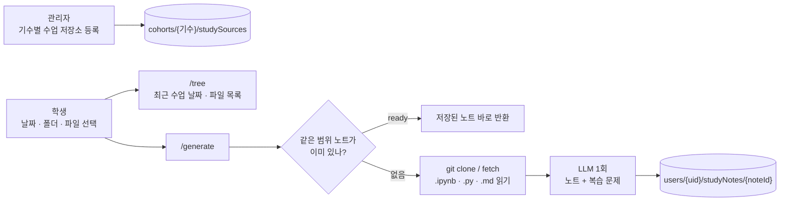

# 공부방 AI 수업 노트

> **4차 이주 상태 (2026-09-23):** Django 인증 `/api/study-notes/{tree,generate,get}`
> → 내부 토큰으로 보호된 AI `/api/v1/study-notes/internal/{tree,generate,get}`
> → PostgreSQL `study_sources`/`study_notes` 경로를 추가했다. 기존 아래
> Firebase ID 토큰 API는 3차 호환 경로로 남아 있다. 검증용 RDS에 `0005`
> migration과 읽기 쿼리를 확인했지만, 실제 Git 저장소·LLM 생성과 최종 React
> 화면의 종단 간 검증은 아직 아니다. 운영 전에는 AI 서비스 URL/공유 토큰 설정과
> 실제 학생 데이터 검증이 필요하다.

수업 자료가 올라가는 GitHub 저장소를 읽어 **그날 수업(또는 고른 폴더·파일)을 학습 노트와 복습 문제로**
정리해 준다. 수업을 일부 놓친 학생이 코드를 다시 따라 할 수 있게 하는 것이 목표다.

앱의 **공부방 → 수업 노트**에서 쓴다(`lib/features/study_room/`).

## 흐름



1. 관리자가 기수마다 수업 저장소를 등록한다: 제목, 저장소 주소, 브랜치, 허용 폴더(`allowedPrefixes`).
2. 학생이 범위를 고른다.

   | scopeType | scopeValue | 가져오는 파일 |
   |---|---|---|
   | `date` | `2026-09-14` | 그날(KST) 커밋에서 바뀐 파일, 파일마다 가장 최신 커밋 |
   | `prefix` | `day12/pandas` | 그 폴더 아래 파일 |
   | `files` | `["day12/a.ipynb", ...]` | 고른 파일(최대 8개) |

3. 서버가 저장소를 받아 `.ipynb`·`.py`·`.md`만 읽는다. 노트북은 셀을 텍스트로 바꾼다.
4. LLM을 **한 번** 불러 노트와 복습 문제를 함께 받는다.
5. 결과를 학생 본인 문서에 저장한다. 같은 범위를 다시 열면 LLM을 부르지 않고 저장본을 준다.

## RAG가 아니라 자료 전체를 넣는 이유

한 번에 정리하는 분량이 파일 8개, 합계 28,000자 이하라 컨텍스트에 전부 들어간다. 파일별 분석 →
품질 검토 → 수정으로 나누면 LLM을 4~8번 불러야 해서 너무 느리다. 그래서 자료 전체를 넣고 노트와
복습 문제를 한 번에 받는다(`pipeline.py`).

## 노트 형식

첫 블록(`reportMarkdown`):

- 오늘의 핵심 한 문장 / 전체 수업 흐름 / 파일별 학습 내용 / 핵심 코드와 개념
- 이전 학습과의 연결 / 실행 체크리스트 / 내가 직접 해볼 실습 / 포트폴리오 회고 포인트

둘째 블록(`reviewMarkdown`): 개념 확인 3문제, 코드 흐름 2문제, 응용 1문제와 정답·해설

프롬프트는 자료에 없는 내용을 지어내지 말라고 지시한다. 학생에게 필요 없는 커밋 해시,
"변경 커밋"·"수업 날짜" 메타 박스, "확인할 수 없음" 같은 문구는 서버가 한 번 더 지운다.

## 제한과 보호 장치

| 항목 | 값 |
|---|---|
| 한 번에 정리하는 파일 | 최대 8개. 날짜·폴더 범위가 더 넓으면 `too_broad`와 파일 목록을 돌려주고 학생이 고르게 한다 |
| 파일당 / 전체 글자 | 8,000자 / 28,000자. 넘으면 "(일부만)"으로 표시 |
| 경로 | 허용 폴더 밖, `..` 포함 경로는 422 |
| 동시 생성 | Firestore 트랜잭션으로 `generating` 상태를 선점한다. 10분 안에 같은 요청이 오면 "이미 정리 중"을 돌려준다 |
| 실패 | 문서를 `failed`와 오류 메시지로 남긴다 |
| git fetch | 같은 저장소는 2분 안에 다시 받지 않는다 |
| 권한 | 학생·강사는 자기 기수만, 관리자는 모든 기수. 비활성 계정은 403 |

## API

통합 서버(포트 8000)에 붙어 있다. 모두 `Authorization: Bearer <Firebase ID 토큰>`이 필요하다.

| 경로 | 요청 | 응답 |
|---|---|---|
| `POST /api/v1/study-notes/tree` | `{cohortId, sourceId}` | 최근 수업 날짜 `dates`, 파일 목록 `entries` |
| `POST /api/v1/study-notes/generate` | `{cohortId, sourceId, scopeType, scopeValue}` | `status`가 `ready`면 `reportMarkdown`·`reviewMarkdown`·`files` |
| `POST /api/v1/study-notes/get` | `{cohortId, noteId}` 또는 `{cohortId, sourceId, scopeType, scopeValue}` | 저장된 노트. 없으면 `status: missing` |

`status` 값: `ready`, `generating`, `too_broad`, `failed`, `missing`

| 상태 코드 | 언제 |
|---|---|
| 401 | 토큰 없음·만료 |
| 403 | 다른 기수, 비활성 계정 |
| 404 | 등록된 저장소가 없음, 범위에 분석할 파일이 없음 |
| 409 | 비활성화된 수업 저장소 |
| 422 | 잘못된 범위·경로·날짜 |
| 502 | git clone·fetch 실패 |

## 실행

서버 PC에 **Git이 설치되어 있어야 한다.** 공개 저장소를 `git clone`으로 읽으므로 GitHub 토큰은 필요 없다.

```text
OPENAI_API_KEY=
STUDY_NOTES_MODEL=          # 비우면 LMS_NODE_MODEL, 그것도 없으면 gpt-5.6-sol
STUDY_NOTES_CACHE_DIR=      # 저장소를 받아 둘 곳. 비우면 임시 폴더/skn34-study-notes
FIREBASE_PROJECT_ID=skn34-3rd-2team
```

```powershell
python -m uvicorn app.integrated:app --app-dir cover_letter_rag --host 127.0.0.1 --port 8000
```

- 앱의 서버 주소를 바꾸려면 `--dart-define=STUDY_NOTES_API_URL=http://호스트:포트`.
- 이미 만든 노트는 Firestore에 있어서 서버가 꺼져 있어도 볼 수 있다. **새로 만들 때만** 서버가 필요하다.
- LLM 호출 제한 시간은 120초, 재시도는 1번이다.

## 파일

| 파일 | 역할 |
|---|---|
| `api.py` | FastAPI 라우터. Firebase 토큰 검증 |
| `service.py` | 권한 확인, 범위 검증, 노트 ID, 생성 선점·저장 |
| `git_tools.py` | 저장소 주소·브랜치·경로 검증, clone/fetch 캐시, 날짜별 변경 파일, 노트북 → 텍스트 |
| `pipeline.py` | 프롬프트, 자료 묶기, LLM 호출, 노트·복습 문제 분리 |

## 알려진 한계

- 한 번에 8개 파일까지만 정리한다. 하루 수업 파일이 더 많으면 나눠서 만들어야 한다.
- 노트는 학생마다 따로 만든다. 같은 날 같은 범위를 여러 학생이 열면 LLM도 학생 수만큼 부른다.
- 자동 테스트가 없다.
