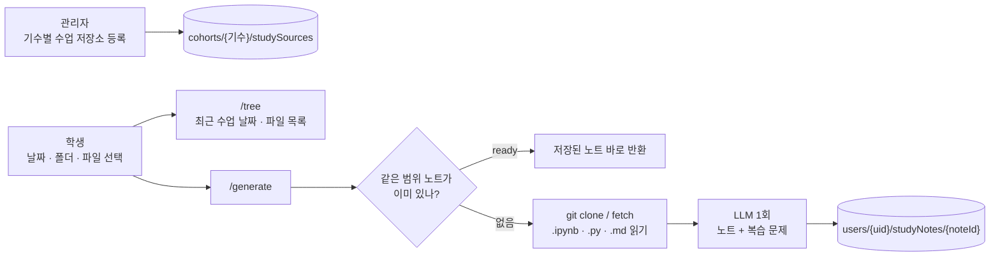

# 공부방 AI 수업 노트

수업 자료가 올라가는 GitHub 저장소를 읽어 **그날 수업(또는 고른 폴더·파일)을 학습 노트와 복습 문제로**
정리해 준다. 수업을 일부 놓친 학생이 코드를 다시 따라 할 수 있게 하는 것이 목표다.

앱의 **공부방 → 수업 노트**에서 쓴다(`lib/features/study_room/`).

## 흐름



1. 관리자가 기수마다 수업 저장소를 등록한다: 제목, 저장소 주소, 브랜치, 허용 폴더(`allowedPrefixes`).
2. 학생이 범위를 고른다.

   | scopeType | scopeValue | 가져오는 파일 |
   |---|---|---|
   | `date` | `2026-09-14` | 그날(KST) 커밋에서 바뀐 파일, 파일마다 가장 최신 커밋 |
   | `prefix` | `day12/pandas` | 그 폴더 아래 파일 |
   | `files` | `["day12/a.ipynb", ...]` | 고른 파일(최대 8개) |

3. 서버가 저장소를 받아 `.ipynb`·`.py`·`.md`만 읽는다. 노트북은 셀을 텍스트로 바꾼다.
4. LLM을 **한 번** 불러 노트와 복습 문제를 함께 받는다.
5. 결과를 학생 본인 문서에 저장한다. 같은 범위를 다시 열면 LLM을 부르지 않고 저장본을 준다.

## RAG가 아니라 자료 전체를 넣는 이유

한 번에 정리하는 분량이 파일 8개, 합계 28,000자 이하라 컨텍스트에 전부 들어간다. 파일별 분석 →
품질 검토 → 수정으로 나누면 LLM을 4~8번 불러야 해서 너무 느리다. 그래서 자료 전체를 넣고 노트와
복습 문제를 한 번에 받는다(`pipeline.py`).

## 노트 형식

첫 블록(`reportMarkdown`):

- 오늘의 핵심 한 문장 / 전체 수업 흐름 / 파일별 학습 내용 / 핵심 코드와 개념
- 이전 학습과의 연결 / 실행 체크리스트 / 내가 직접 해볼 실습 / 포트폴리오 회고 포인트

둘째 블록(`reviewMarkdown`): 개념 확인 3문제, 코드 흐름 2문제, 응용 1문제와 정답·해설

프롬프트는 자료에 없는 내용을 지어내지 말라고 지시한다. 학생에게 필요 없는 커밋 해시,
"변경 커밋"·"수업 날짜" 메타 박스, "확인할 수 없음" 같은 문구는 서버가 한 번 더 지운다.

## 제한과 보호 장치

| 항목 | 값 |
|---|---|
| 한 번에 정리하는 파일 | 최대 8개. 날짜·폴더 범위가 더 넓으면 `too_broad`와 파일 목록을 돌려주고 학생이 고르게 한다 |
| 파일당 / 전체 글자 | 8,000자 / 28,000자. 넘으면 "(일부만)"으로 표시 |
| 경로 | 허용 폴더 밖, `..` 포함 경로는 422 |
| 동시 생성 | Firestore 트랜잭션으로 `generating` 상태를 선점한다. 10분 안에 같은 요청이 오면 "이미 정리 중"을 돌려준다 |
| 실패 | 문서를 `failed`와 오류 메시지로 남긴다 |
| git fetch | 같은 저장소는 2분 안에 다시 받지 않는다 |
| 권한 | 학생·강사는 자기 기수만, 관리자는 모든 기수. 비활성 계정은 403 |

## API

통합 서버(포트 8000)에 붙어 있다. 창구가 두 갈래다.

**LMS(React · Django)** — 웹은 Django 를 부르고, Django 가 JWT 로 학생을 확인한 뒤 DB(`study_sources`)의 저장소 정보를
아래 `/proxy/*` 로 넘긴다. 노트는 Django 가 `study_notes` 에 저장한다(`lms_api/lms/study_note_service.py`).
노트 하나에 몇 분 걸려 gunicorn·nginx 의 120초를 넘으므로, Django 는 「정리 중」 행을 먼저 돌려주고 스레드에서 기다린다.

| 경로 | 요청 | 응답 |
|---|---|---|
| `POST /api/study-notes/tree` (Django) | `{sourceId}` | `dates`, `entries` |
| `POST /api/study-notes` (Django) | `{sourceId, scopeType, scopeValue}` | 노트 행. 새로 만들면 `status: generating` |
| `GET /api/study-notes/{id}` (Django) | | 노트 행 — 화면이 5초마다 물어 끝났는지 본다 |
| `POST /api/v1/study-notes/proxy/tree` (여기) | `{cohortId, source: {id, title, repoUrl, branch, allowedPrefixes}}` | `dates`, `entries` |
| `POST /api/v1/study-notes/proxy/generate` (여기) | 위 + `{scopeType, scopeValue}` | `ready` 면 노트 내용, `too_broad` 면 파일 목록. 저장하지 않는다 |
| `POST /api/v1/study-notes/proxy/repos` (여기) | `{owner}` | GitHub 조직·계정의 저장소 `repos` — Django 가 공부방에 자동으로 올릴 때 |
| `POST /api/v1/study-notes/proxy/practice` (여기) | 소스 + `{coverage, today}` | 새로 낸 복습 세트 `sets`, 새 출제 범위 기록 `coverage` — 매일 18:30 자동 출제 |

`/proxy/*` 는 이력서 첨삭의 `/proxy` 처럼 인증이 없다 — 바깥에 열지 않고 Django 만 부른다.

**수업 저장소 자동 등록** — 강사(자기 기수)·관리자가 기수에 GitHub 조직이나 강사 개인 계정을 연결하면
(`study.github_owners`, `scripts/firestore_to_postgres/study_schema.sql`), 그 안의 저장소를 `study_sources` 에
바로 공개로 올린다. 이미 있는 저장소는 건드리지 않아 숨긴 저장소는 숨긴 채 남는다. 저장소 관리 화면을 열 때(10분에 한 번까지),
「저장소 새로 찾기」, Celery beat 한 시간마다 찾는다(`lms_api/lms/study_source_service.py`).
비공개 저장소는 AI 서버 환경변수 `GITHUB_TOKEN`(읽기 전용)으로 받는다. 없으면 로컬에선 이 PC 의 git 로그인을 쓴다.
Django 가 만드는 노트 키(`lms_api/lms/study_scope.py`)는 여기 `build_scope_key` 와 같아야 한다(`tests/test_study_notes_lms.py` 가 본다).

**Flutter 앱** — 아래 경로. 모두 `Authorization: Bearer <Firebase ID 토큰>`이 필요하고 Firestore 에 저장한다.

| 경로 | 요청 | 응답 |
|---|---|---|
| `POST /api/v1/study-notes/tree` | `{cohortId, sourceId}` | 최근 수업 날짜 `dates`, 파일 목록 `entries` |
| `POST /api/v1/study-notes/generate` | `{cohortId, sourceId, scopeType, scopeValue}` | `status`가 `ready`면 `reportMarkdown`·`reviewMarkdown`·`files` |
| `POST /api/v1/study-notes/get` | `{cohortId, noteId}` 또는 `{cohortId, sourceId, scopeType, scopeValue}` | 저장된 노트. 없으면 `status: missing` |

`status` 값: `ready`, `generating`, `too_broad`, `failed`, `missing`

| 상태 코드 | 언제 |
|---|---|
| 401 | 토큰 없음·만료 |
| 403 | 다른 기수, 비활성 계정 |
| 404 | 등록된 저장소가 없음, 범위에 분석할 파일이 없음 |
| 409 | 비활성화된 수업 저장소 |
| 422 | 잘못된 범위·경로·날짜 |
| 502 | git clone·fetch 실패 |

## 실행

서버 PC에 **Git이 설치되어 있어야 한다.** 공개 저장소를 `git clone`으로 읽으므로 GitHub 토큰은 필요 없다.

```text
OPENAI_API_KEY=
STUDY_NOTES_MODEL=          # 비우면 LMS_NODE_MODEL, 그것도 없으면 gpt-5.6-sol
STUDY_NOTES_CACHE_DIR=      # 저장소를 받아 둘 곳. 비우면 임시 폴더/skn34-study-notes
FIREBASE_PROJECT_ID=skn34-3rd-2team
```

```powershell
python -m uvicorn app.integrated:app --app-dir cover_letter_rag --host 127.0.0.1 --port 8000
```

- 앱의 서버 주소를 바꾸려면 `--dart-define=STUDY_NOTES_API_URL=http://호스트:포트`.
- 이미 만든 노트는 Firestore에 있어서 서버가 꺼져 있어도 볼 수 있다. **새로 만들 때만** 서버가 필요하다.
- LLM 호출 제한 시간은 120초, 재시도는 1번이다.

## 파일

| 파일 | 역할 |
|---|---|
| `api.py` | FastAPI 라우터. Firebase 토큰 검증 |
| `service.py` | 권한 확인, 범위 검증, 노트 ID, 생성 선점·저장 |
| `git_tools.py` | 저장소 주소·브랜치·경로 검증, clone/fetch 캐시, 날짜별 변경 파일, 노트북 → 텍스트 |
| `pipeline.py` | 프롬프트, 자료 묶기, LLM 호출, 노트·복습 문제 분리 |
| `practice/` | 실습 문제 생성·검증 (아래 「실습 문제」) |

## 알려진 한계

- 한 번에 8개 파일까지만 정리한다. 하루 수업 파일이 더 많으면 나눠서 만들어야 한다.
- 노트는 학생마다 따로 만든다. 같은 날 같은 범위를 여러 학생이 열면 LLM도 학생 수만큼 부른다.
- 노트 생성 자체에는 자동 테스트가 없다. 실습 문제 검증은 `study_notes/tests/`에 있다.

## 실습 문제 (1단계: 생성 + 검증)

노트의 복습 문제는 읽기만 되는 마크다운이다. 여기서는 **실행해서 채점할 수 있는 문제**를 따로 만든다.
아직 저장·API·화면은 없다. 몇 개 날짜로 돌려 **검증 통과율**부터 잰다.

```
수업 자료 → LLM 초안(JSON) → 실행 전 거름(ast) → Pyodide로 실행 → 떨어진 것만 1회 고쳐 재검증
```

| 종류 | 통과 조건 |
|---|---|
| `concept` | 보기 3개 이상, 정답 번호가 범위 안 (실행 안 함) |
| `code_output` | 두 번 돌려 출력이 같고, 4줄·160자 이하. **정답은 LLM 예상이 아니라 실행 결과** |
| `code_blank` | 빈칸(`__1__`)을 `None`으로 채우면 테스트 실패, 모범 답으로 채우면 통과. 학생 답도 글자 비교가 아니라 테스트로 채점 |
| `code_fix` | 버그 코드 + 테스트는 실패(시간 초과 포함), 모범답안 + 테스트는 통과 |
| `code_write` | 빈 함수 + 테스트는 실패, 모범답안 + 테스트는 통과 |
| `code_scratch` | `code_write` 와 같고, 학생이 뼈대를 못 보므로 문제 문장에 함수 이름 · 테스트 3개 이상 · 모범답안 4줄 이상 |

실행 전에 버리는 코드: 파일 읽기(`open`, `read_csv` …), 네트워크, `input()`, `os`·`sys`, 현재 시각,
표준 라이브러리 일부·numpy·pandas 외의 패키지.

```powershell
cd practice_verifier; npm install; cd ..
python -m study_notes.practice.trial --repo https://github.com/ORG/REPO --date 2026-09-15
python -m study_notes.practice.trial --local lesson.ipynb
python -m unittest study_notes.tests.test_practice_verify
```

결과 JSON은 저장소 캐시 폴더의 `practice_runs/`에 남는다(`--out`으로 바꿀 수 있다). 모델은 노트와 따로
`PRACTICE_MODEL`(비우면 `gpt-5.6-luna`)을 쓴다. 34기 멀티모달 3일로 비교했을 때 `gpt-4o-mini`는 torch·cv2로
짜다 막히거나 코드 문제를 포기했고, luna는 18문제가 한 번에 검증을 통과했다.

| 파일 | 역할 |
|---|---|
| `practice/models.py` | 문제 구조, LLM 초안 정리 |
| `practice/generate.py` | 출제·고치기 프롬프트, LLM 호출, 토큰 집계 |
| `practice/verify.py` | 통과 규칙 (여기에만 있다) |
| `practice/runner.py` | `practice_verifier/`를 subprocess로 부른다. Docker로 가면 HTTP로 바꿀 자리 |
| `practice/build.py` | 생성 → 검증 → 고치기 → 통계 |
| `practice/trial.py` | 시험 실행 CLI |
| `practice/increments.py` | 파일 단위 출제 — 새로 생긴 셀 찾기, 하루 배분, 출제 범위 기록 |
| `practice/daily.py` | 날짜를 차례로 돌며 파일 단위로 출제하는 CLI |

### 파일 단위 출제 (날짜 간 중복 없애기)

수업이 중간에 끝나면 다음 날 같은 노트북에 셀을 이어 붙인다. 34기 multimodal 의
`02_video_rag_frame_extraction.ipynb` 는 9/14 에 셀 11개, 9/15 에 21개였고 앞 10개가 같았다.
날짜마다 파일 전체로 출제하면 같은 내용으로 문제가 두 번 나온다.

`practice/increments.py` 가 파일마다 「이미 출제한 셀」의 지문을 기억해 두고 **새로 생긴 셀로만** 출제한다.

| 경우 | 처리 |
|---|---|
| 처음 보는 파일 | 전체가 새 셀 |
| 뒤에 셀이 붙음 | 붙은 셀만. 앞부분은 제목·정의 이름만 요약해 문맥으로 넘긴다 |
| 오타 수정처럼 90% 넘게 같은 셀 | 본 것으로 친다 |
| 새 내용이 200자 미만 | 그날 그 파일은 건너뛴다 |
| 하루 12문제 배분 | 파일마다 1개, 남은 개수는 새 내용이 많은 파일부터(파일당 최대 8) |
| 문제 구성 | 개념 2 · 출력 예상 3 · 빈칸 2 · 디버깅 2 · 함수 작성 2 · 처음부터 1. 12개보다 적으면 가벼운 코드 문제부터 채운다 |

「이미 출제한 셀」 기록(`FileCoverage`)은 모듈이 저장하지 않는다. 받고 돌려줄 뿐이라, 지금은 JSON 파일이고
DB 를 붙이면 그 자리만 바뀐다.

```powershell
# 계획만 — LLM 을 부르지 않고 어느 파일의 어느 부분으로 몇 문제 낼지
python -m study_notes.practice.daily --repo https://github.com/ORG/REPO --dates 2026-09-14 2026-09-15 --plan-only
# 실제 출제 · 검증. 기록은 cov.json 에 남고 다음 실행이 이어 쓴다
python -m study_notes.practice.daily --repo ... --dates 2026-09-16 --coverage cov.json
```

9/14 → 9/15 로 돌려 보면 위 노트북은 9/15 에 「새 셀 10개 · 이미 출제한 셀 10개 → 1문제 · 이어짐」이 되고,
9/14 에는 OpenCV 소개로, 9/15 에는 새로 붙은 프레임 추출(`frame_interval`)로 문제가 나왔다.

### 자동 출제 (매일 18:30)

강사가 수업 저장소에 올린 내용으로 LMS 가 알아서 문제를 낸다. 노트는 지금처럼 학생이 필요할 때 만든다.

```
Celery beat 18:30(Asia/Seoul) — lms_api/lms/practice_auto.py
  공개된 수업 저장소 중 자동 출제가 켜진 것마다(켜짐이 기본, 강사 「수업 저장소」 화면에서 끈다)
    practice.coverage 의 기록 → AI 서버 POST /api/v1/study-notes/proxy/practice (practice/auto.py)
      마지막으로 출제한 날부터 오늘까지, 새로 생긴 셀로만 출제 → 검증 → 고치기
    ← 세트 · 새 기록 → practice.sets · problems 에 넣고 기록을 이어 쓴다
```

| 경우 | 처리 |
|---|---|
| 처음 보는 저장소 | 14일 안의 가장 최근 수업 하루만. 연결하자마자 지난 과목 전체를 출제하지 않고, 끝난 과목은 내지 않는다 |
| 저녁 늦게 올린 커밋 | 다음 날 18:30 에 그 날짜로 하루 몫(12문제)에서 남은 만큼만 채운다 |
| 같은 날짜 세트가 이미 있음(손으로 넣은 세트 포함) | 새 세트를 만들지 않고 그 뒤에 문제를 붙인다 |
| 한 날짜가 실패 | 거기서 멈추고 앞날까지만 기록 — 다음 실행이 실패한 날부터 다시 |
| 수업이 일찍 끝남 · 지난 과목 | 강사 「지금 만들기」에서 수업 날짜를 골라(한 번에 5일까지) 출제. 뒤에서 돌고 화면이 10초마다 끝났는지 본다 |
| 자동 출제는 늘 최근 14일 안에서만 | 지난 날짜를 골라 만든 뒤에도 18:30 이 그 과목 전체를 메우지 않게. 새 문제가 없으면 이유(끝난 과목 · 이미 출제함 · 새 내용 없음)를 남긴다 |

실행 기록은 `study.practice_runs`, 저장소별 켜짐은 `study.practice_settings`(`scripts/firestore_to_postgres/study_schema.sql`).
검증기(practice_verifier, node)가 AI 서버에 있어야 한다 — 배포 이미지(`deploy/ai.Dockerfile`)에 들어 있다.

